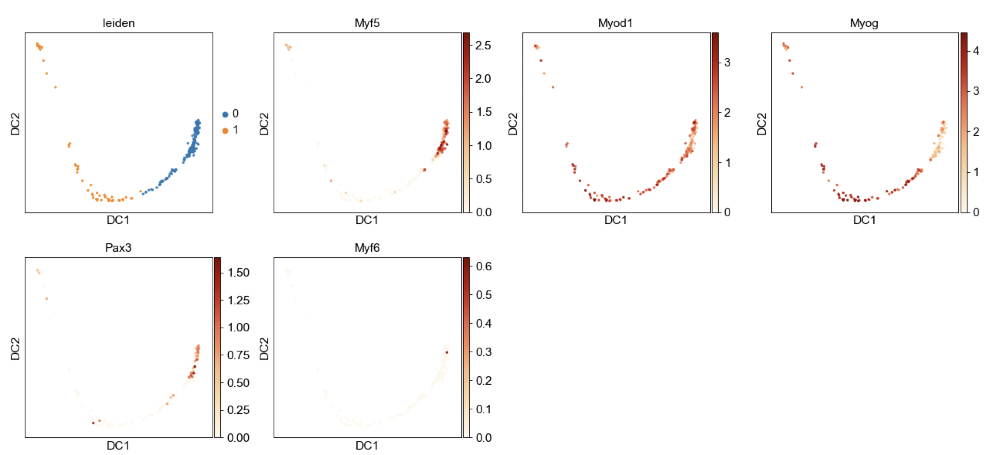
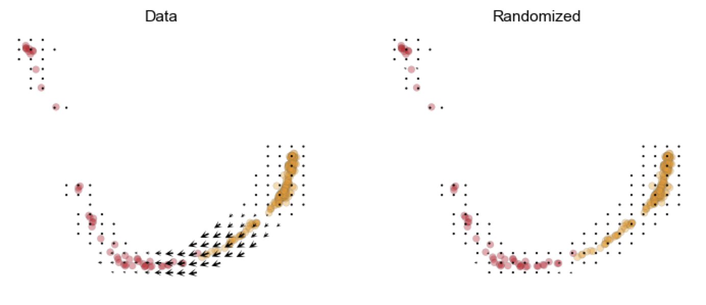
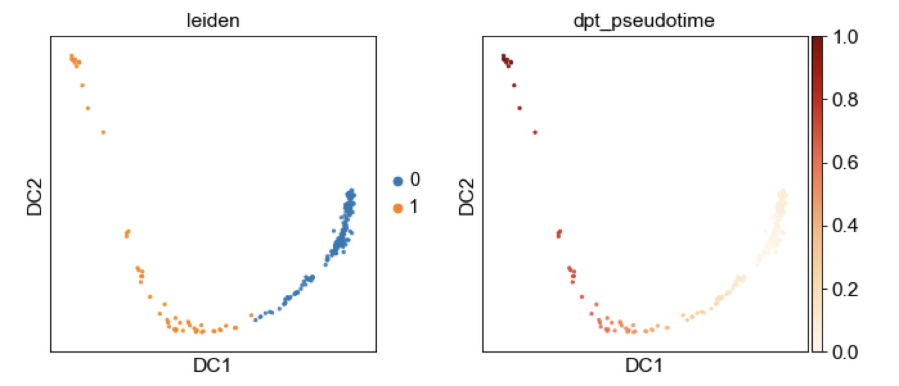
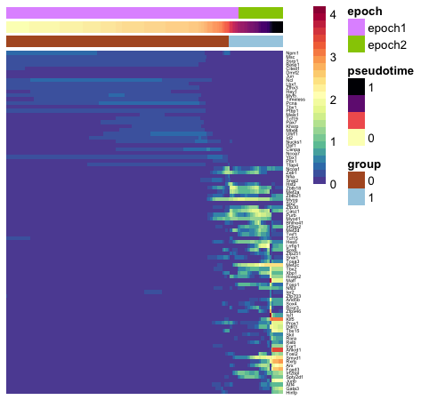
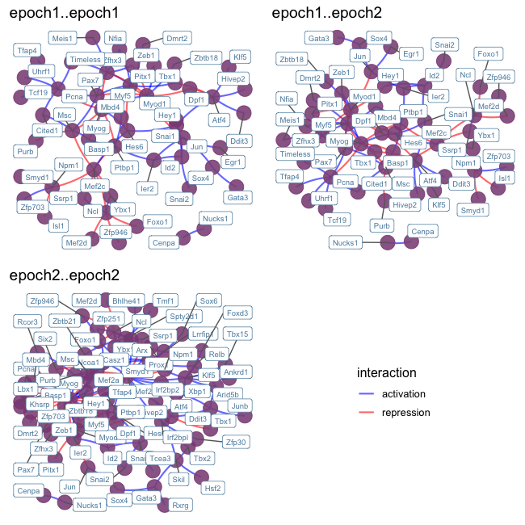
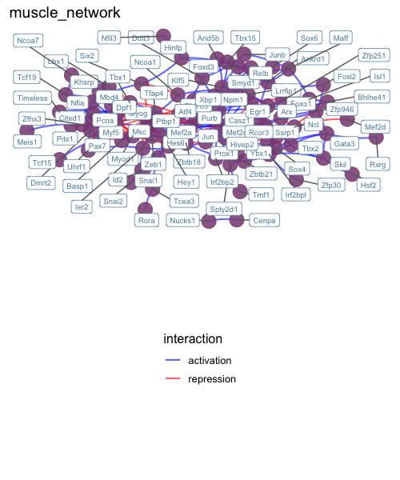
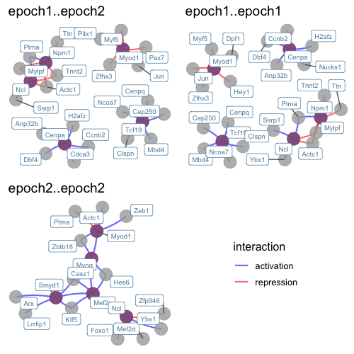
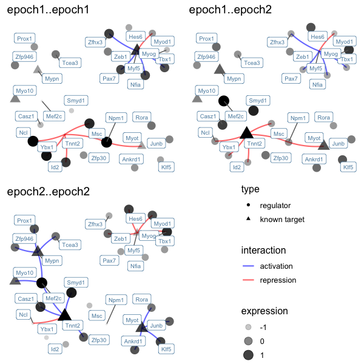

# Epoch
Dynamic gene regulatory network reconstruction from scRNA-seq data.


## Introduction
Epoch leverages single-cell transcriptomic data, single-cell analysis methods, and graph theoretic approaches to elucidate GRN structure and dynamic activity. 

## Data

This data is unpublished data from our lab. It is of muscle development at e12.5. It has already been normalized, and the varying genes have been identified. It has also been clustered, and analyzed with RNA Velocity (Velocyto). Here is what the data look like after applying diffusion map:



And here is RNA Velocity result:



And here is the ordering of the cells based on diffusion pseudotime (dpt):



Now, let's use Epoch to reconstruct the GRNs that underpin this trajectory.

## Example Walk Thru 0: The Basics

### Set up
```R
library(igraph)
library(qgraph)
library(ggnetwork)
library(gridExtra)
library(pheatmap)
library(RColorBrewer)
library(loomR)
library(reshape2)
library(gam)
library(singleCellNet)
library(minet)

install_github("pcahan1/epoch")
library(epoch)

```

### Load data
```R
list12<-loadDataFromLoom("data/adMuscle_E12_DPT_071919.loom")
expDat<-list12[['expDat']]
sampTab<-list12[['sampTab']] 
expDat<-expDat[rowSums(expDat)!=0,]

mmTFs<-utils_loadObject("data/mmTFs_123019.rda")
mmTFs<-intersect(rownames(expDat),mmTFs)
```

### Static Network Reconstruction
Reconstruction occurs in three steps: 

1. Find dynamically expressed genes
2. Infer edges across dynamic genes using CLR (or other supported method)
3. Perform optional cross-weighting to refine network structure
  
```R
# Find dynamically expressed genes
xdyn <- findDynGenes(expDat, sampTab, group_column="leiden",pseudotime_column="dpt_pseudotime")
pThresh<-0.05
dgenes<-names(xdyn$genes)[xdyn$genes<pThresh]

# Reconstruct and perform crossweighting
grnDF <- reconstructGRN(expDat[dgenes,], mmTFs, method="pearson", zThresh=3)
grnDF <- crossweight(grnDF,expDat,xdyn,filter_thresh=0)

# Example alternative: to reconstruct using GENIE3, run reconstructGRN_GENIE3 prior to crossweighting.
# grnDF <- reconstructGRN_GENIE3(expDat[dgenes,], mmTFs, weightThresh=.5)

```
  
The object grnDF contains the reconstructed network. TG and TF refer to target gene and transcription factor respectively. The column "zscore" is the network prior to crossweighting. The column "weighted_score" is the network after crossweighting:

```R
head(grnDF)

#    TG     TF   zscore       corr    offset weighted_score
#1 Eya1  Dmrt2 4.772928  0.2133278  2.371429       4.772928
#2 Eya1   Lbx1 3.556854  0.2278536 -5.057143       3.556854
#3 Eya1   Myog 4.178345 -0.2610965 -7.942857       4.178345
#4  Msc  Basp1 4.161489  0.3269736 -3.400000       4.161489
#5  Msc Cited1 5.910916  0.2740953 -1.342857       5.910916
#6  Msc  Mef2c 4.542714 -0.4582923 11.114286       1.176779

```

### Dynamic Network Extraction
We can further explore changes in the network across time by defining "epochs" or time periods in our trajectory, assigning genes to these epochs, and extracting a dynamic network across time.  

Defining epochs can be done in a number of ways. Here we show an example with method="pseudotime". This will partition cells based on pseudotime (pseudotime will be divided evenly, unless specified with parameter psuedotime_cuts). Althernatively, we can define epochs by "cell_order", in which cells are partitioned based on raw cell order rather than pseudotime, or "group", in which partitions are pre-defined.  

For a simpler approach, assign_epoch_simple() will define and assign epochs based on maximum mean expression of a gene. This approach assumes genes cannot belong to more than one epoch.

```R
xdyn<-define_epochs(xdyn,expDat[dgenes,],method="pseudotime",num_epochs=2)
epoch_assignments<-assign_epochs(expDat[dgenes,],xdyn)

dynamic_grn<-epochGRN(grnDF,epoch_assignments)

#     from     to           name
# 1 epoch1 epoch2 epoch1..epoch2
# 2 epoch1 epoch1 epoch1..epoch1
# 3 epoch2 epoch2 epoch2..epoch2


# Example alternative:
# assignment_list<-assign_epoch_simple(expDat[dgenes,],xdyn)

```
  
  The object dynamic_grn stores the dynamic network across epochs. The list includes active subnetworks at each epoch (in this example, "epoch1..epoch1" and "epoch2..epoch2") as well as potential transition networks (in this example, "epoch1..epoch2") describing how network topology transitions from one epoch to another.


### Influential TFs
We can use Epoch to identify the most influential regulators in the reconstructed dynamic (or static) network. Here's an example of accomplishing this via a PageRank approach on the dynamic network. 

```R
gene_rank<-compute_pagerank(dynamic_grn,weight_column="weighted_score")

```
  
  The object gene_rank now contains a list of rankings for each epoch and transition network:
  
```R
head(gene_rank$epoch1..epoch1)

#        gene  page_rank is_regulator
# Npm1   Npm1 0.03762543         TRUE
# Myod1 Myod1 0.03364017         TRUE
# Ncl     Ncl 0.03127770         TRUE
# Cenpa Cenpa 0.02515734         TRUE
# Tcf19 Tcf19 0.01872991         TRUE
# Myf5   Myf5 0.01835270         TRUE

head(gene_rank$epoch2..epoch2)

#          gene  page_rank is_regulator
# Myog     Myog 0.06439718         TRUE
# Mef2c   Mef2c 0.05445604         TRUE
# Myod1   Myod1 0.01987631         TRUE
# Smyd1   Smyd1 0.01777028         TRUE
# Ncl       Ncl 0.01706675         TRUE
# Zbtb18 Zbtb18 0.01263173         TRUE

```
  
  We can also use betweenness and degree. 

```R
another_gene_rank<-compute_betweenness_degree(dynamic_grn,weight_column="weighted_score")

```
The object another_gene_rank now contains a list of rankings for each epoch and transition network:
  
```R
head(another_gene_rank$epoch1..epoch1)

#        gene betweenness     degree is_regulator
# Ncl     Ncl  0.23020757 0.15887850         TRUE
# Npm1   Npm1  0.21577234 0.16448598         TRUE
# Myod1 Myod1  0.17964927 0.18504673         TRUE
# Ybx1   Ybx1  0.13691064 0.09719626         TRUE
# Hes6   Hes6  0.11030138 0.10093458         TRUE
# Myf5   Myf5  0.08138892 0.10841121         TRUE

head(another_gene_rank$epoch2..epoch2)

#        gene betweenness     degree is_regulator
# Mef2c Mef2c   0.5390451 0.42780027         TRUE
# Myog   Myog   0.2044352 0.32658570         TRUE
# Klf5   Klf5   0.2290878 0.10931174         TRUE
# Casz1 Casz1   0.2052850 0.09041835         TRUE
# Smyd1 Smyd1   0.1158734 0.15519568         TRUE
# Arx     Arx   0.1736952 0.07962213         TRUE

```


### Plotting
Epoch contains various plotting tools to visualize dynamic activity of genes and networks.


#### We can visualize dynamically expressed genes across time
This is particularly useful for verifying epoch assignments, and gauging how many epochs should occur in a trajectory.

```R
# First, smooth expression for a cleaner plot
ccells <- xdyn$cells
expSmoothed <- grnKsmooth(expDat, ccells, BW=0.1)

# Plot a heatmap of the dynamic TFs
tfstoplot<-intersect(dgenes,mmTFs)
dynTFs<-xdyn
dynTFs$genes<-dynTFs$genes[names(dynTFs$genes) %in% tfstoplot]
hm_dyn(expSmoothed,dynTFs,topX=100)

# Plot a heatmap of all dynamic TFs and target genes
# dyngenes<-xdyn
# dyngenes$genes<-dyngenes$genes[names(dynTFs$genes) %in% dgenes]
# hm_dyn(expSmoothed,dyngenes,topX=100)

```



#### We can plot a basic plot of the dynamic network
```R
plot_dynamic_network(dynamic_grn,mmTFs,only_TFs=TRUE,order=c("epoch1..epoch1","epoch1..epoch2","epoch2..epoch2"))

```
  
  
  
  
  To plot all targets, we can set only_TFs=FALSE. We can specify which epochs to plot using the "order" parameter. These coincide with names(dynamic_grn). If left empty, all epoch networks and transition networks will be plotted.  
  
  The same function can be used to plot a static network.  

```R
plot_dynamic_network(list(muscle_network=grnDF),mmTFs,only_TFs=TRUE)

```
  
  



#### We can plot top regulators and their top targets
In the same fashion as above, we can do this for both the dynamic network and static network. Limiting visualization to top regulators and their targets is less cumbersome than the above plots.

```R
plot_top_regulators(dynamic_grn, gene_rank, mmTFs, only_TFs=FALSE)

# We can specify additional parameters including the number of top TFs and targets:
# plot_top_regulators(dynamic_grn, gene_rank, tfs, numTopTFs=3, numTargets=5, only_TFs=TRUE, order=c("epoch1..epoch1","epoch1..epoch2","epoch2..epoch2"))

```



#### We can plot top regulators of specified targets
If we are interested in specific target genes, we can use one of the following functions to plot those and their top regulators as follows.

```R
interesting_targets<-c("Myf5","Myo10","Mypn","Myot","Tnnt2")

# plot_targets_with_top_regulators(dynamic_grn,interesting_targets,weight_column="zscore")

plot_targets_with_top_regulators_detail(dynamic_grn,interesting_targets,epoch_assignments,weight_column="zscore",declutter=FALSE,order=c("epoch1..epoch1","epoch1..epoch2","epoch2..epoch2"))


```


  
  


