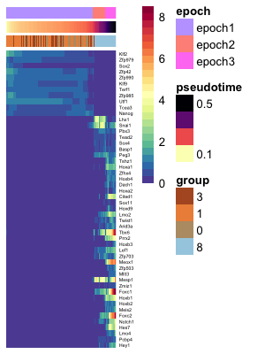
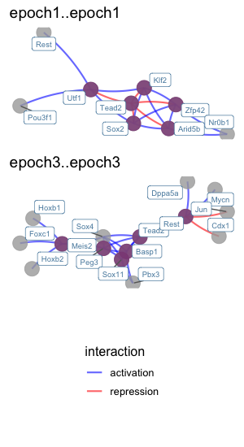
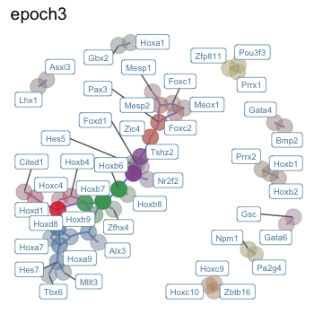
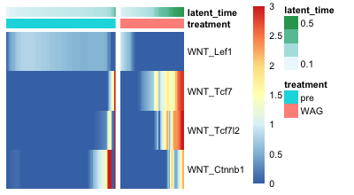

# Epoch
Dynamic gene regulatory network reconstruction from scRNA-seq data.


## Introduction
Epoch leverages single-cell transcriptomic data, single-cell analysis methods, and graph theoretic approaches to reconstruct dynamic GRNs. Additionally, Epoch contains functionality for top regulator prediction, network comparision, signaling pathway integration, amongst others. Here we show some examples of Epoch in action.

1. [Setup](#setup)
2. [Example 1: Reconstruction](#example1)
3. [Example 2: Network Comparison](#example2)
4. [Example 3: Signaling Pathway Integration](#example3)


## Setup <a name="setup"></a>
```R

install_github("pcahan1/epoch")
library(epoch)

```

## Example 1: Reconstruction <a name="example1"></a>

### Data

This data is unpublished data from our lab. It is sampled from day 0 through day 4 mESC directed differentiation toward mesodermal fate guided by Wnt3a, Activin A, and GSKi. It has already been normalized, and the varying genes have been identified. It has also been clustered, and analyzed with RNA Velocity.

### Load data
```R
library(epoch)

list12<-loadDataFromLoom("data/sampled_mesoderm_WAG.loom")
expDat<-list12[['expDat']]
sampTab<-list12[['sampTab']] 

mmTFs<-utils_loadObject("data/mmTFs.rda")
mmTFs<-intersect(rownames(expDat),mmTFs)
```

### Static Network Reconstruction
Reconstruction occurs in three steps: 

1. Find dynamically expressed genes
2. Infer edges across dynamic genes using CLR (or other supported method)
3. Perform optional cross-weighting to refine network structure
  
```R
# Find dynamically expressed genes
xdyn <- findDynGenes(expDat, sampTab, group_column="cluster", pseudotime_column="latent_time")
pThresh<-0.05
dgenes<-names(xdyn$genes)[xdyn$genes<pThresh]

# Reconstruct and perform crossweighting
grnDF <- reconstructGRN(expDat, mmTFs, dgenes, method="pearson", zThresh=3)
grnDF <- crossweight(grnDF,expDat,xdyn,filter_thresh=0)

# Example alternative: to reconstruct using GENIE3, run reconstructGRN_GENIE3 prior to crossweighting.
# grnDF <- reconstructGRN_GENIE3(expDat, mmTFs, dgenes, weightThresh=.5)

```
Note: To use Mutual Information, set method to "MI". Set zThresh and filter_thresh to tune interactions via removing edges below the threshold.


The object grnDF contains the reconstructed network. TG and TF refer to target gene and transcription factor respectively. The column "zscore" is the network prior to crossweighting. The column "weighted_score" is the network after crossweighting:

```R
grnDF[5:15,]

#        TG     TF   zscore       corr     offset weighted_score
# 5  Prdm14   Nfib 3.846711  0.2371545  3.0895522       3.846711
# 6  Prdm14 Zfp990 3.390523  0.2574008  3.7761194       3.390523
# 7  Prdm14   Rest 3.102711  0.2485766  1.7761194       3.102711
# 8  Prdm14  Nanog 4.598733  0.2892227 11.4776119       2.896073
# 9  Prdm14  Tead2 3.114365 -0.2491080  7.1492537       3.114365
# 10 Prdm14  Zfp42 5.641972  0.3185379 -0.6865672       5.641972
# 11 Prdm14   Klf2 3.344418  0.2563452  0.9104478       3.344418
# 12 Prdm14  Rhox6 3.648716  0.2528058 -8.4477612       3.648716
# 13   Eya1  Hoxb4 3.133878  0.1504617 11.7313433       1.947923
# 14   Eya1   Gli3 4.176600  0.1663259  5.5671642       4.176600
# 15   Eya1  Foxc1 3.976296  0.1660566  3.3582090       3.976296

```

### Dynamic Network Extraction
We can further explore changes in the network across time by defining "epochs" or time periods in our trajectory, assigning genes to these epochs, and extracting a dynamic network across time.  

Defining epochs can be done in a number of ways. Here we show an example with method="pseudotime". This will partition cells based on pseudotime (pseudotime will be divided evenly, unless specified with parameter psuedotime_cuts). Althernatively, we can define epochs by "cell_order", in which cells are partitioned based on raw cell order rather than pseudotime, or "group", in which partitions are pre-defined.  

For a simpler approach, assign_epoch_simple() will define and assign epochs based on maximum mean expression of a gene. This approach assumes genes cannot belong to more than one epoch.

```R
xdyn<-define_epochs(xdyn,expDat,method="pseudotime",num_epochs=3)
epoch_assignments<-assign_epochs(expDat,xdyn)

dynamic_grn<-epochGRN(grnDF,epoch_assignments)

#     from     to           name
# 1 epoch1 epoch2 epoch1..epoch2
# 2 epoch2 epoch3 epoch2..epoch3
# 3 epoch1 epoch1 epoch1..epoch1
# 4 epoch2 epoch2 epoch2..epoch2
# 5 epoch3 epoch3 epoch3..epoch3


# Example alternative:
# assignment_list<-assign_epoch_simple(expDat[dgenes,],xdyn)

```
  
  The object dynamic_grn stores the dynamic network across epochs. The list includes active subnetworks at each epoch (in this example, "epoch1..epoch1","epoch2..epoch2", etc.) as well as potential transition networks (in this example, "epoch1..epoch2" and "epoch2..epoch3") describing how network topology transitions from one epoch to another.


### Influential TFs
We can use Epoch to identify the most influential regulators in the reconstructed dynamic (or static) network. Here's an example of accomplishing this via a PageRank approach on the dynamic network. 

```R
gene_rank<-compute_pagerank(dynamic_grn,weight_column="weighted_score")

```
  
  The object gene_rank now contains a list of rankings for each epoch and transition network:
  
```R
head(gene_rank$epoch1..epoch1)
#          gene  page_rank is_regulator
# Utf1     Utf1 0.03967890         TRUE
# Zfp42   Zfp42 0.03151797         TRUE
# Klf2     Klf2 0.03036168         TRUE
# Sox2     Sox2 0.02456489         TRUE
# Tead2   Tead2 0.01598365         TRUE
# Arid5b Arid5b 0.01581432         TRUE

head(gene_rank$epoch3..epoch3)
#        gene  page_rank is_regulator
# Tead2 Tead2 0.02687836         TRUE
# Sox11 Sox11 0.02512396         TRUE
# Rest   Rest 0.01709808         TRUE
# Peg3   Peg3 0.01599903         TRUE
# Basp1 Basp1 0.01265988         TRUE
# Meis2 Meis2 0.01253277         TRUE

```
  
  We can also use betweenness and degree. 

```R
another_gene_rank<-compute_betweenness_degree(dynamic_grn,weight_column="weighted_score")

```
The object another_gene_rank now contains a list of rankings for each epoch and transition network:
  
```R
head(another_gene_rank$epoch1..epoch1)
#        gene betweenness     degree is_regulator
# Utf1   Utf1  0.27817182 0.42617801         TRUE
# Sox2   Sox2  0.27811474 0.39581152         TRUE
# Klf2   Klf2  0.15267323 0.45863874         TRUE
# Zfp42 Zfp42  0.12816798 0.45026178         TRUE
# Tead2 Tead2  0.09685535 0.26387435         TRUE
# Tgif1 Tgif1  0.16497086 0.04397906         TRUE

```


### Plotting
Epoch contains various plotting tools to visualize dynamic activity of genes and networks.


#### We can visualize dynamically expressed genes across time
This is particularly useful for verifying epoch assignments, and gauging how many epochs should occur in a trajectory. Here we plot the expression of 50 TFs along pseudotime.

```R
# First, smooth expression for a cleaner plot
ccells <- xdyn$cells
expSmoothed <- grnKsmooth(expDat, ccells, BW=0.03)

# Plot a heatmap of the dynamic TFs
tfstoplot<-intersect(dgenes,mmTFs)
dynTFs<-xdyn
dynTFs$genes<-dynTFs$genes[names(dynTFs$genes) %in% tfstoplot]
hm_dyn(expSmoothed,dynTFs,topX=50)

# Plot a heatmap of all dynamic TFs and target genes
# dyngenes<-xdyn
# dyngenes$genes<-dyngenes$genes[names(dynTFs$genes) %in% dgenes]
# hm_dyn(expSmoothed,dyngenes,topX=100)

```



#### We can plot a basic plot of the dynamic network
```R
plot_dynamic_network(dynamic_grn,mmTFs,only_TFs=TRUE,order=c("epoch1..epoch1","epoch2..epoch2","epoch3..epoch3"))

```  
  
  To plot all targets, we can set only_TFs=FALSE. We can specify which epochs to plot using the "order" parameter. These coincide with names(dynamic_grn). If left empty, all epoch networks and transition networks will be plotted.  
  
  The same function can be used to plot a static network.  

```R
plot_dynamic_network(list(mesoderm_network=grnDF),mmTFs,only_TFs=TRUE)

```

  These may be cumbersome, so instead it may be useful to limit which interactions to plot. For example, we can limit the plot to edges with weight above a certain threshold, using the "thresh" parameter. Alternatively, it may be more informative to look at top regulators and their top targets:


#### We can plot top regulators and their top targets
In the same fashion as above, we can do this for both the dynamic network and static network. Limiting visualization to top regulators and their targets is less cumbersome than the above plots.

```R
plot_top_regulators(dynamic_grn, gene_rank, mmTFs, numTopTFs=6, only_TFs=FALSE,order=c("epoch1..epoch1","epoch3..epoch3"))

# We can specify additional parameters including the number of top TFs and targets:
# plot_top_regulators(dynamic_grn, gene_rank, tfs, numTopTFs=3, numTargets=5, only_TFs=TRUE, order=c("epoch1..epoch1","epoch1..epoch2","epoch2..epoch2"))

```



#### We can plot top regulators of specified targets
If we are interested in specific target genes, we can use one of the following functions to plot those and their top regulators as follows.

```R
interesting_targets<-c("Mesp1","Foxc1","Tbx6","Meis2")

# plot_targets_with_top_regulators(dynamic_grn,interesting_targets,weight_column="zscore")

plot_targets_with_top_regulators_detail(dynamic_grn,interesting_targets,epoch_assignments,weight_column="weighted_score",numTopRegulators=3,declutter=FALSE,order=c("epoch2..epoch2","epoch3..epoch3"))


```


  
## Example 2: Network Comparison <a name="example2"></a>

We can use Epoch to compare networks. Here's an example of doing so at the edge level. In this instance we use Epoch to extract "differential networks".  


Starting with the network we reconstructed in Example 1, we can compare it to a network reconstructed using data collected from mESC directed differentiation toward mesoderm guided by a separate treatment. Alternatively, such a method may be used to compare in vitro networks with in vivo networks.


### Data

First, load in the data. The reconstructed network and epoch assignments from the previous section are provided here as 'net1' and epochs1': 

```R
# load in the reconstructed network and epochs
net1<-utils_loadObject("data/example1_net.rda")
epochs1<-utils_loadObject("data/example1_epochs.rda")

# load in a second network and epochs
net2<-utils_loadObject("data/example2_net2.rda")
epochs2<-utils_loadObject("data/example2_epochs2.rda")

mmTFs<-utils_loadObject("data/mmTFs.rda")

```
  
  
### Compute the differential network

We can compute the differential network between network1 (GRN reconstructed in Example 1) and network2 (GRN just loaded in).

```R
# Run edge_uniqueness to tally differences in edges
res<-edge_uniqueness(list(network1=net1,network2=net2),mmTFs,weight_column="weighted_score")

# Run dynamic_difference_network to extract the dynamic differential network
network1_on<-dynamic_difference_network(res, list(network1=epochs1,network2=epochs2), "network1", type="on", diff_thresh=7.5, condition_thresh=10)

# Add interaction type
network1_on<-add_type(network1_on,"on",net1,list(x=net2))


``` 
The edges in the resulting differential network are those that are differentially active in network 1.
We can tune the threshold "diff_thresh" to increase or decrease the difference threshold at which an edge is considered differentially active. We can tune the threshold "condition_thresh" to change the threshold at which an edge is considered active in a given network.

The weight_column parameter in edge_uniquness can be changed to reflect the proper edge weight. For example, other metrics of importance can be used in place of the crossweighted score, such as degree product. 

This is what the differential network looks like:

```R
head(network1_on$epoch2)
#              TG     TF network1     diff       corr interaction
# 1 1700003F12Rik   Nfia 4.666154 4.666154  0.2032498  activation
# 2 1700019D03Rik   Peg3 3.126144 2.746125 -0.3131408  repression
# 3 1700019D03Rik    Sp5 3.168844 3.003888 -0.3071091  repression
# 4 1700097N02Rik  Basp1 4.037780 2.194030 -0.4412966  repression
# 5 1700097N02Rik   Sox4 3.409004 2.396285 -0.4235951  repression
# 6 1700097N02Rik Zfp428 4.664102 2.319699  0.3700874  activation

head(network1_on$epoch3)
#              TG     TF network1     diff       corr interaction
# 1 1700003F12Rik Mllt11 3.737788 3.513406  0.1830396  activation
# 2 1700019D03Rik   Peg3 3.126144 2.746125 -0.3131408  repression
# 3 1700019D03Rik    Sp5 3.168844 3.003888 -0.3071091  repression
# 4 1700097N02Rik  Basp1 4.037780 2.194030 -0.4412966  repression
# 5 1700097N02Rik    Id2 3.039247 2.389706 -0.2079808  repression
# 6 1700097N02Rik   Sox4 3.409004 2.396285 -0.4235951  repression

```

  
### Find communities
We can find community structure within the differential network (or other dynamic network).
```R
communities<-diffnet_community_detection(network1_on)

```
  
  
### Plot the differential network
We can plot the differential network, with or without some details (e.g. colored by cluster, faded by betweenness). Tune threshold parameters when calling dynamic_difference_network to change strictness of including or not including an edge. Here's what the third epoch looks like (with relatively strict thresholds for readability):

```R
# plot_dyn_diffnet(network1_on,mmTFs,only_TFs=TRUE)

plot_diffnet_detail(network1_on,tfs=mmTFs,order=c("epoch3"),weight_column="network1")

```




## Example 3: Signaling Pathway Integration <a name="example3"></a>

We can use Epoch to integrate signaling activity and trace paths through the network. Starting with the dynamic network we constructed in Example 1. 

### Data
```R
list12<-loadDataFromLoom("data/sampled_mesoderm_WAG.loom")
expDat<-list12[['expDat']]
sampTab<-list12[['sampTab']] 

dynamic_grn<-utils_loadObject("data/example1_dyanmicGRN.rda")

xdyn <- findDynGenes(expDat, sampTab, group_column="cluster", pseudotime_column="latent_time")

```

### Get effector targets
Effector targets of major signaling pathways are pre-computed and available within Epoch (mouse).
These lists were computed by: (1) aquiring binding score (MACS2) data for 18 signaling effector TFs from the ChIP-Atlas (Oki et al., 2018), (2) target genes were ranked by maximum binding score, (3) the top 2000 targets were retained (or all retained, if less than 2000 targets).

  Alternatively, here's how we can derive new effector target lists:

```R
effectors<-load_SP_effectors(path="data/mouse_signaling_binding")
effectors<-score_targets(effectors)
effectortargets<-find_targets(effectors,column="max_score",by_rank=TRUE,n_targets=2000)

# Instead of "max_score", we could have also ranked by "mean_score" or "percent_freq".
# Instead of retaining the top n_targets, we could have also specified a cutoff threshold by specifying the 'threshold' parameter.

```

### Signaling pathway activity
We can estimate signaling activity over time by quantifying the expression of effector targets. As an example, let's look at Wnt signaling. Unsurprisingly, we see strong activity as cells progress toward mesodermal fate. 

Alternatively, we could instead look at all pathways to understand differences in major signaling pathways between treatments, conditions, etc. (See manuscript for details)

```R
# Wnt signaling
wnt_targets<-effectortargets[c("WNT_Ctnnb1","WNT_Lef1","WNT_Tcf7","WNT_Tcf7l2")]

# lets separate by pre-treatment and treatment
# adding in the treatment information
ccells<-xdyn$cells
ccells$treatment<-sampTab$treatment[match(as.character(ccells$cell_name),as.character(sampTab$obs_names))]

# compute mean module expression over time
pre_exp<-mean_module_expression(expDat[,rownames(ccells[ccells$treatment=='pre',])],wnt_targets)
treatment_exp<-mean_module_expression(expDat[,rownames(ccells[ccells$treatment=='WAG',])],wnt_targets)

heatmap_by_treatment_group(list(pre=pre_exp,treatment=treatment_exp),sampTab,pseudotime_column="latent_time",limits=c(0,3),order_by="treatment")

```




### Paths toward target genetic programs
Now that we have reconstructed a dynamic network and predicted effector target genes, we can integrate signaling pathway activity with the GRN. For example, we can trace the effects of Wnt signaling in activating a mesoderm-like program (or simply, some genes of interest). 


```R
# Some interesting mesoderm TFs, plus Sox17 (an endoderm TF)
interesting_genes<-c("Mesp1","Foxc1","Foxc2","Tbx6","Sox17")

# Paths from b-catenin to interesting genes
bcat_to_meso<-dynamic_shortest_path_multiple(dynamic_grn,effectortargets$WNT_Ctnnb1,interesting_genes)
bcat_to_meso<-cor_and_add_action(bcat_to_meso,expDat)

# Paths from Tcf7 to interesting genes
tcf7_to_meso<-dynamic_shortest_path_multiple(dynamic_grn,effectortargets$WNT_Tcf7,interesting_genes)
tcf7_to_meso<-cor_and_add_action(tcf7_to_meso,expDat)

# Paths from Tcf7l2 to interesting genes
tcf7l2_to_meso<-dynamic_shortest_path_multiple(dynamic_grn,effectortargets$WNT_Tcf7l2,interesting_genes)
tcf7l2_to_meso<-cor_and_add_action(tcf7l2_to_meso,expDat)

```

Here's what this looks like:
```R
head(tcf7l2_to_meso)

#     from    to                     path distance action distance_over_average action_by_corr
# 1 Zfp703 Mesp1      Zfp703--Peg3--Mesp1 1.815449      1             0.6427952              1
# 2 Zfp703 Foxc1      Zfp703--Hey1--Foxc1 1.784579      1             0.6318649              1
# 3 Zfp703 Foxc2    Zfp703--Notch1--Foxc2 1.755712      1             0.6216439              1
# 4 Zfp703  Tbx6       Zfp703--Lmo2--Tbx6 1.794707      1             0.6354509              1
# 5   Mtf2 Mesp1        Mtf2--Utf1--Mesp1 1.907707     -1             0.6754609             -1
# 6   Mtf2 Foxc1 Mtf2--Utf1--Mesp1--Foxc1 2.747748     -1             0.9728935             -1

```

TF's in the column 'from' are targets of the effector TF Tcf7l2. Genes in the column "to" are targets from interesting_genes. The column 'path' describes the shortest path through the reconstructed network. The column 'distance_over_average' is the normalized distance (paths with values < 1 are shorter than the average path length).

Overly long paths and infinite-length paths (i.e. no path exists), indicate a network topology in which activation or inhibition of the given signaling pathway cannot easily control the given target. For example, unsurprisingly, Sox17 (an endoderm marker) is not reachable from any Wnt effector in this mesodermal network:

```R
bcat_to_meso[tcf7l2_to_meso$to=="Sox17",]
# [1] from                  to                    path                  distance             
# [5] action                distance_over_average action_by_corr       
# <0 rows> (or 0-length row.names)

tcf7_to_meso[tcf7l2_to_meso$to=="Sox17",]
# [1] from                  to                    path                  distance             
# [5] action                distance_over_average action_by_corr       
# <0 rows> (or 0-length row.names)

tcf7l2_to_meso[tcf7l2_to_meso$to=="Sox17",]
# [1] from                  to                    path                  distance             
# [5] action                distance_over_average action_by_corr       
# <0 rows> (or 0-length row.names)


```

By applying this method to dynamic networks reconstructed from different datasets, it's possible to elucidate topologies unsuitable or restrictive to specific cell fates. By apply this method more broadly via exhaustive search of paths from all major signaling effectors to specific sets of targets, it's possible to predict the necessary signaling activity required for directing specific cell fates. 

(For more info on how we used this method to elucidate network topologies favoring mesodermal fate, to compare how activation and suppression of different signaling pathways impacts network topology, and a more in depth analysis on tracing paths from signaling effectors to target genes, see our manuscript).


