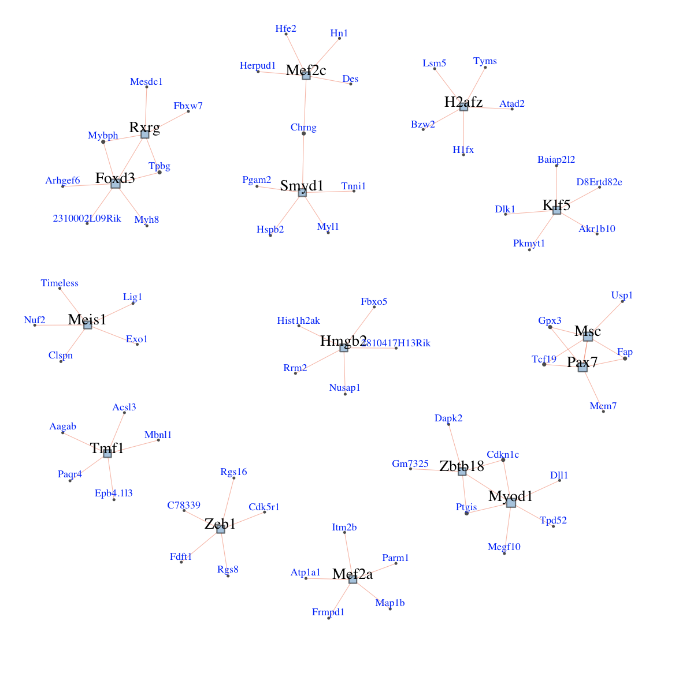

# warpnet
gene regulatory network reconstruction from scRNA-Seq using dynamic time warp


## Introduction
warpNet: reconstruct GRNs from scRNA-Seq data useing trajectory inference and dynamic time warp.

## Data

This data is unpublished data from our lab. It is of muscle development at e12.5. It has already been normalized, and the varying genes have been identified. It has also been clustered, and analyzed with RNA Velocity (Velocyto). Here is what the data look like after applying diffusion map:


And here is RNA Velocity result:


And here is the ordering of the cells based on diffusion pseudotime (dpt):


Now, let's use warpNet to reconstruct the GRNs that underpin this trajectory.


## Example Walk thru 1

#### Set up
```R

library(igraph)
library(qgraph)
library(loomR)
library(gam)

library(devtools)
install_github("pcahan1/singleCellNet")

library(singleCellNet)

install_github("pcahan1/warpnet")
library(warpnet)

# uncomment next line if you opt to use PAM instead of k-means. PAM is recommended
# library(cluster)

library(minet)

mydate<-utils_myDate()

```

#### Load data
```R
# Data is in the R package data folder
pathToWarpNet = "../"
mmTFs<-utils_loadObject( paste0(pathToWarpNet, "data/mmTFs.rda") )

# remove Pcna and App which are not TFs. Please take note of other non-TFs that you find and create an issue so that we can remove them
mmTFs <- setdiff(mmTFs, c("App", "Pcna"))

list12<-loadLoomExpUMAP( paste0(pathToWarpNet, "data/adMuscle_E12_DPT_071919.loom", xname='leiden', has_dpt_groups=FALSE)
expDat<-list12[['expDat']]
sampTab<-list12[['sampTab']] # holds the clustering and pca/umap info

grps<-as.vector(sampTab$cluster)
names(grps)<-as.vector(sampTab$cell_name)
```

#### Find dynamically expressed genes
```R

# PCA was done in scanpy/python and stored in sampTab
system.time(xdyn <- findDynGenes(expDat, sampTab, c("0","1")))

starting gammma...
   user  system elapsed 
 14.195   1.693  15.972
```

#### Smooth expression
```R
ccells = xdyn$cells
system.time(expSmoothed <- grnKsmooth(expDat, ccells))
  user  system elapsed 
  0.832   0.013   0.850 

 dim(expSmoothed)
[1] 2074  262
```

#### Cluster genes into epochs
```R

geneDF = caoGenes(expSmoothed, xdyn, k=3, pThresh=0.01, method='kmeans')
# you can also use pam to cluster the genes (recommended)
# geneDF = caoGenes(expSmoothed, xdyn, k=3, pThresh=0.01, method='pam')

gdfForHM = as.data.frame(geneDF[,"epoch"])
rownames(gdfForHM) = rownames(geneDF)
hm_dyn_clust(testSm, xdyn, geneAnn= gdfForHM, toScale=TRUE)

# you can also add colors ...
# vcols1 = c("#feb24c", "#fc4e2a", "#b10026")
# hm_dyn_clust(testSm, xdyn, geneAnn= gdfForHM, row_cols=vcols1, toScale=TRUE)

```


#### Reconstruct GRN
 NB: only using un-smoothed data of dynamically expressed genes for GRN
```R
system.time(grnDF <- reconstructGRN(expDat[rownames(geneDF),], mmTFs, zThresh=3))
   user  system elapsed 
  0.215   0.023   0.238

dim(grnDF)
[1] 1803    4
```

#### Add PT-based weight to GRN

normDist is difference in peakTimes between TF and TG. Negative if the sign of the difference is inconsistent with predicted regulatory influence based on CLR network (from pearson)
```R
system.time(grnDF <- addDistWeight(grnDF, geneDF, ncells = ncol(expSmoothed), maxNeg= -0.2))
   user  system elapsed 
  0.183   0.004   0.186 

 grnDF[1:3,]
    TG    TF   zscore      corr adjWeight   normDist
1 Eya1 Meis1 3.022976 0.9911989  2.692854 0.09809160
2 Eya1  Pcna 3.245824 0.9913648  3.075591 0.08282443
3  Msc Dnmt1 3.006199 0.9881022  2.647884 0.10038168

```

#### Need a function that will give a lot of information for each TF that can be used as a basis for better and more diverse way of selecting TFs
Here is a start to do so
```R
tfTab = evalTFs(grnDF, geneDF)

 tfTab[order(tfTab$weightMean, decreasing=T),][1:10,]
                 TF num_TFs epoch distToStart weightTotal weightMean
Zeb1           Zeb1      15     2           3    76.14665   3.626031
Hist1h2ak Hist1h2ak      36     1         199    58.97373   3.103880
Hist1h2ae Hist1h2ae      36     1         193    20.54976   2.935680
Myod1         Myod1      15     2          82   115.62926   2.890731
Smyd1         Smyd1      25     3         202   115.27090   2.881773
H2afx         H2afx      36     1         191    44.35505   2.772191
Hmgb2         Hmgb2      36     1         177    65.87164   2.744652
Mef2a         Mef2a      15     2         106    91.15749   2.604500
Six2           Six2      36     1          99    20.82408   2.603010
Prox1         Prox1      25     3         141    27.47881   2.498073
```


#### Score TFs per epoch

```R
 pickExemplars(  geneDF,grnDF, topX=5, type='weight')
$`1`
[1] "H2afz" "Pax7"  "Meis1" "Hmgb2" "Msc"  

$`2`
[1] "Myod1"  "Zbtb18" "Mef2a"  "Zeb1"   "Tmf1"  

$`3`
[1] "Smyd1" "Foxd3" "Rxrg"  "Mef2c" "Klf5" 
```


#### Plot these + top 5 positive regulons
```R
iG_x = ig_exemplars(grnDF, geneDF, topTFs, topX=5) 
x2 = ig_convertMedium(iG_x, vScale=2)
e = get.edgelist(x2, names=FALSE)
l <- qgraph.layout.fruchtermanreingold(e,vcount=vcount(x2))
plot(x2, layout=l)
```




#### Here is a way to plot just the MST of the TF-only GRN
```R
grnP1 = wn_ig_tabToIgraph(grnDF, geneDF,directed=T)
newG1 = grnP1
V(newG1)$size <- 8
V(newG1)$frame.color <- "white"
E(newG1)$arrow.mode <- 0

eCols = list("1" = "red", "-1"= "blue")
E(newG1)$color <- as.vector(unlist(eCols[as.character(E(newG1)$corr)]))
V(newG1)$color <- vcols1[as.numeric(V(newG1)$epoch)]
V(newG1)$size <- 4

#now remove all non-regulators
newG1 = delete.vertices(newG1, V(newG1)[ V(newG1)$type!="Regulator" ] )

mstRes1 = mst(newG1, weights=  E(newG1)$weight, algorithm="prim")

l1 <- layout_with_kk(mstRes1, weights=E(mstRes1)$weight)

# you can resize based on node features
# V(mstRes1)$size <- (1+ tfTab_P1[V(mstRes1),]$weightTotal/max(tfTab_P1$weightTotal))**2

plot( mstRes1,layout=l1, vertex.label.dist=-0.5,  vertex.label.color="black", vertex.label.cex=0.6)
```


## Example Walk thru 2

#### Set up
```R

library(igraph)
library(qgraph)
library(loomR)
library(gam)

library(devtools)
install_github("pcahan1/singleCellNet")

library(singleCellNet)

install_github("pcahan1/warpnet")
library(warpnet)

# uncomment next line if you opt to use PAM instead of k-means. PAM is recommended
# library(cluster)

library(minet)
library(GENIE3)
library(reshape2)

mydate<-utils_myDate()

```

#### Load data
```R
list12<-loadLoomExpDiffMap("adMuscle_E12_DPT_071919.loom", xname='leiden', has_dpt_groups=FALSE)
expDat<-list12[['expDat']]
sampTab<-list12[['sampTab']]
expDat<-expDat[rowSums(expDat)!=0,]

```

#### Use wrapper functions to run any subset of methods

Run CLR (either Pearson's or MI), Epoch (reconstruct on dynamically expressed genes), or GENIE3 (on or not on dyngenes).
Later on call addDistWeight to run Peak-Time Weighting.

```R
tfs<-intersect(rownames(expDat),mmTFs)

# To run all methods set methods - 'all'
# system.time(res<-reconstructGRN_across_methods(expDat,sampTab,tfs,methods='all',c("0","1")))

# To run a subset of methods, choose from c("CLR_pearson","CLR_MI","Epoch_pearson","Epoch_MI","GENIE3","GENIE3_dyngenes")

# Run Epoch_MI and GENIE3_dyngenes
system.time(res<-reconstructGRN_across_methods(expDat,sampTab,tfs,methods=c('Epoch_MI','GENIE3_dyngenes'),c("0","1")))

   user  system elapsed 
379.412   4.888 384.625 

```

#### Apply a threshold to call positive, convert to a data frame
The resulting data frame will have columns TG, TF, corr, and zscore-- note that GENIE3 does not actually return a zscore (but for the sake of code consistency...)
```R
enet_mi<-res$enet_mi
enet_df<-cn_extractRegsDF(enet_mi,cor(t(enet_mi)),rownames(enet_mi),threshold=3)

gnet_dyn<-res$gnet_dyn
gnet_df<-cn_extractRegsDF(gnet_dyn,cor(t(gnet_dyn)),rownames(gnet_dyn),threshold=0.1)

```


#### Apply Peak-Time Weighting
```R
# Extract geneDF from res. This is the data frame that contains information on each gene and peak time.
# In this case, we take res$geneDF_dyn which contains information on only the dynamically expressed genes.
# res$geneDF_all contains the information for all genes.

geneDF<-res$geneDF_dyn

enet_df<-addDistWeight(enet_df, geneDF, ncells = ncol(expDat), maxNeg= -0.2)
gnet_df<-addDistWeight(gnet_df, geneDF, ncells = ncol(expDat), maxNeg= -0.2)


```
#### From here you can summarize TF stats, score TFs, or plot (see walk-thru 1)


#### You can also be really crazy and run every method both with and without PT-weighting
This is useful for benchmarking...

```R
res<-reconstructGRN_all_methods(expDat,sampTab,tfs,c("0","1"))

```


