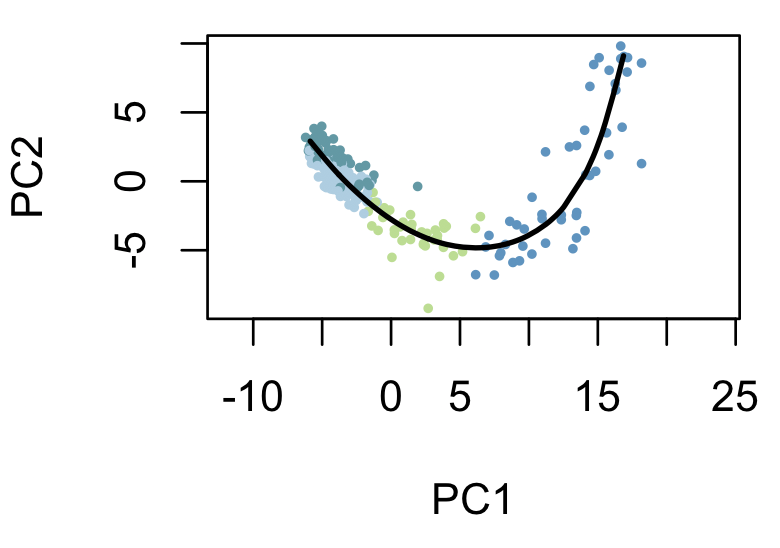
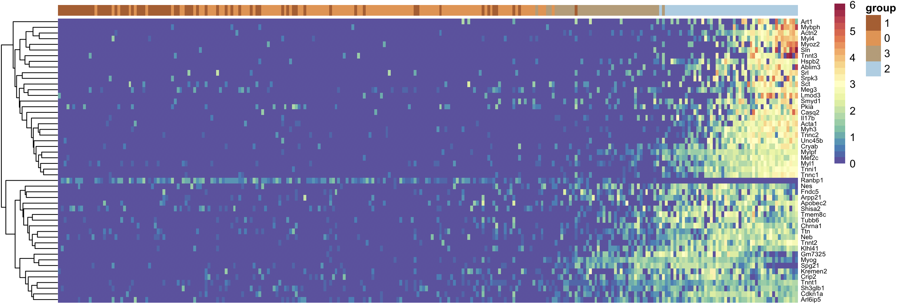
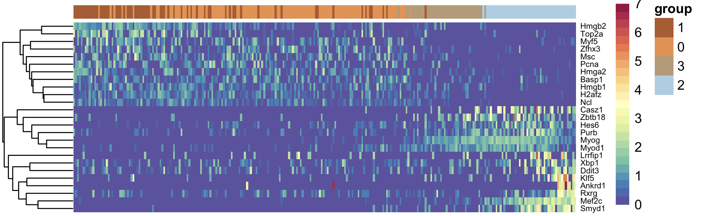
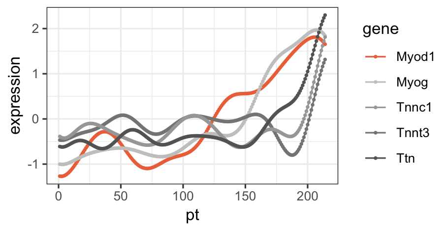

# warpnet
gene regulatory network reconstruction from scRNA-Seq using dynamic time warp


### Introduction
warpNet: reconstruct GRNs from scRNA-Seq data useing trajectory inference and dynamic time warp.

### Data

This data is unpublished data from our lab. It is of muscle development at e12.5. It has already been normalized, and the varying genes have been identified.

### Walk thru

#### Set up
```R
library(devtools)
install_github("pcahan1/singleCellNet")

library(singleCellNet)

install_github("pcahan1/warpnet")
library(warpnet)


mydate<-utils_myDate()

library(rgl)
library(loomR)
library(slingshot)
library(destiny)
library(RColorBrewer)
library(gam)
library(pheatmap)
library(magick)
library(reshape2)
library(ggplot2)
library(tidyverse)


```

### Load data
```R
# Data is in the R package data folder
pathToWarpNet = "../"
mmTFs<-utils_loadObject( paste0(pathToWarpNet, "data/mmTFs.rda") )

list12<-loadLoomExpUMAP( paste0(pathToWarpNet, "data/e12_Muscle_vgenes_052919.loom", xname='leiden'))
expDat<-list12[['expDat']]
sampTab<-list12[['sampTab']] # holds the clustering and pca/umap info

grps<-as.vector(sampTab$stage_louvain)
names(grps)<-as.vector(sampTab$cell_name)

dim(expDat)
[1] 2123  262
```

### SlingShot trajectory inference
```R

# PCA was done in scanpy/python and stored in sampTab
rd3 <- cbind(PC1 = sampTab$pc1, PC2 = sampTab$pc2)

grps2 = rep(1, length(grps))
i<-1
for(grp in unique(grps)){
  cat(i,"\n")
  grps2[which(grps==grp)] <- i
  i<-i+1
}

rownames(rd3) = colnames(expDat)
lineages <- getLineages(rd3, grps, start.clus=c('1'), end.clus=c('2')) # I know this from expression of muscle genes
curves <- getCurves(lineages, extend='n')

getPalette = colorRampPalette(brewer.pal(2, "Paired"))

plot(rd3, col = getPalette(length(unique(grps)))[grps2], asp = 1, pch = 16, cex=.5)
lines(curves, lwd = 2, col='black')
```



### find genes that have temporally regulated expression
```R

ptimes <- slingPseudotime(curves)

t1<-ptimes[,1]

maxExp = apply(expDat, 1, max)
good = names(which(maxExp>2))
mywhich = function(vect, t=0){ length(which(vect>t)) }

ccount = apply(expDat[good,], 1, mywhich, t=.5)
good2 = names(which(ccount>10))


# fit a GAM with a loess term for pseudotime
system.time(gpC1 <-gamFit(expDat[good2,], rownames(expDat), t1))
  
tgA <- names(sort(gpC1, decreasing = FALSE))[1:50]
ord1 = sort(t1)

hm_ti(expDat[tgA,names(ord1)],genes=tgA, grps[names(ord1)], cRow=T, toScale=T, fontsize_row=6)
```



### Limit to Transcription factors
```R
tgA_500 <- names(sort(gpC1, decreasing = FALSE))[1:500]
tTfs_A<-intersect(tgA_500, mmTFs)
hm_ti(expDat[tTfs_A,names(ord1)],genes=tTfs_A, grps[names(ord1)], cRow=T, toScale=T, fontsize_row=6)


xTFs<-tTfs_A[1:25]
hm_ti(expDat[xTFs,names(ord1)],genes=xTFs, grps[names(ord1)], cRow=T, toScale=T, fontsize_row=6, limits=c(0,7))
```



Now walk thru Michael's code

I broke things so smoothing and fft are separate
```R
xdat2 = t(expDat)
system.time(smDat <- grnSSF(xdat2, order(ptimes),BW=0.025))
plotRegulon(smDat[['ffTed']], "Myod1", c("Myog","Tnnt3","Tnnc1", "Ttn"), ntrim=20)
```




 


