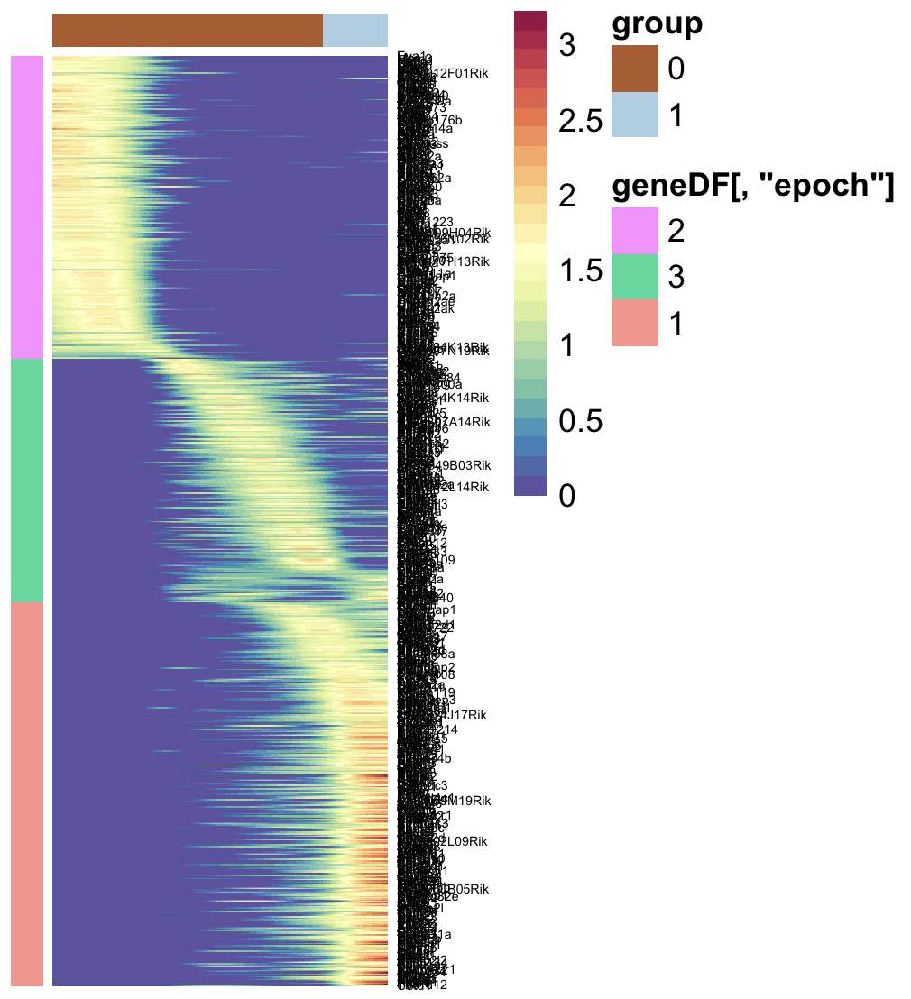
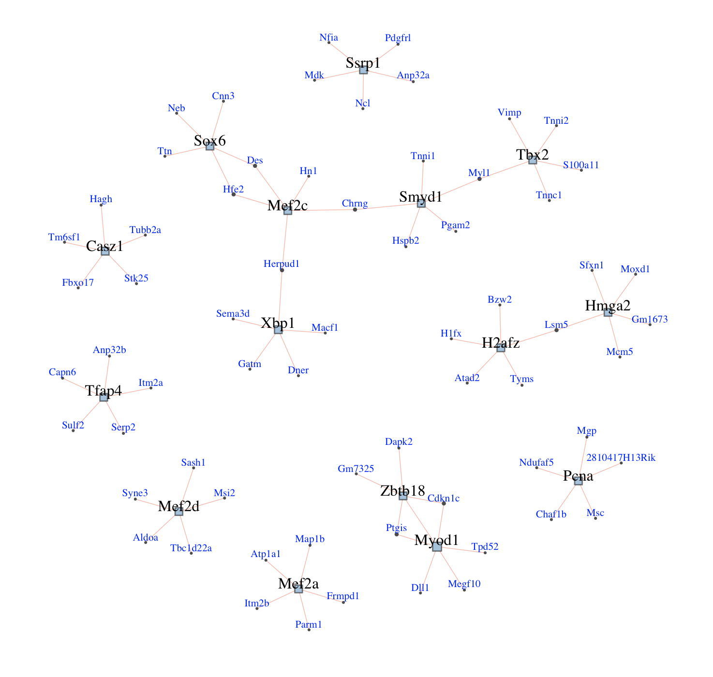

# warpnet
gene regulatory network reconstruction from scRNA-Seq using dynamic time warp


### Introduction
warpNet: reconstruct GRNs from scRNA-Seq data useing trajectory inference and dynamic time warp.

### Data

This data is unpublished data from our lab. It is of muscle development at e12.5. It has already been normalized, and the varying genes have been identified. It has also been clustered, and analyzed with RNA Velocity (Velocyto). Here is what the data look like after applying diffusion map:


And here is RNA Velocity result:


And here is the ordering of the cells based on diffusion pseudotime (dpt):


Now, let's use warpNet to reconstruct the GRNs that underpin this trajectory.


### Walk thru

#### Set up
```R

library(igraph)
library(qgraph)
library(loomR)
library(gam)

library(devtools)
install_github("pcahan1/singleCellNet")

library(singleCellNet)

install_github("pcahan1/warpnet")
library(warpnet)

library(minet)

mydate<-utils_myDate()

```

### Load data
```R
# Data is in the R package data folder
pathToWarpNet = "../"
mmTFs<-utils_loadObject( paste0(pathToWarpNet, "data/mmTFs.rda") )

list12<-loadLoomExpUMAP( paste0(pathToWarpNet, "data/adMuscle_E12_DPT_071919.loom", xname='leiden', has_dpt_groups=FALSE)
expDat<-list12[['expDat']]
sampTab<-list12[['sampTab']] # holds the clustering and pca/umap info

grps<-as.vector(sampTab$cluster)
names(grps)<-as.vector(sampTab$cell_name)
```

### find dynamically expressed genes
```R

# PCA was done in scanpy/python and stored in sampTab
system.time(xdyn <- findDynGenes(expDat, sampTab, c("0","1")))

starting gammma...
   user  system elapsed 
 14.195   1.693  15.972
```

Smooth expression
```R
ccells = xdyn$cells
system.time(expSmoothed <- grnKsmooth(expDat, ccells))
  user  system elapsed 
  0.832   0.013   0.850 

 dim(expSmoothed)
[1] 2074  262
```

Cluster genes into epochs
```R

geneDF = caoGenes(expSmoothed, xdyn, k=3, pThresh=0.01, method='kmeans')
gdfForHM = as.data.frame(geneDF[,"epoch"])
rownames(gdfForHM) = rownames(geneDF)
hm_dyn_clust(testSm, xdyn, geneAnn= gdfForHM, toScale=TRUE)
```



### Reconstruct GRN
```R
system.time(grnDF <- reconstructGRN(expSmoothed, mmTFs, zThresh=4))
   user  system elapsed 
  2.599   0.158   2.786 

dim(grnDF)
[1] 8582    4
```


Score TFs per epoch

```R
topTFs = pickExemplars(geneDF, grnDF, topX=5)
topTFs
$`2`
[1] "Ssrp1" "Pcna"  "Tfap4" "Hmga2" "H2afz"

$`3`
[1] "Myod1"  "Zbtb18" "Mef2a"  "Casz1"  "Mef2d" 

$`1`
[1] "Mef2c" "Sox6"  "Smyd1" "Tbx2"  "Xbp1" 
```


### Plot these + top 5 positive regulons
```R
iG_x = ig_exemplars(grnDF, geneDF, topTFs, topX=5) 
x2 = ig_convertMedium(iG_x, vScale=2)
e = get.edgelist(x2, names=FALSE)
l <- qgraph.layout.fruchtermanreingold(e,vcount=vcount(x2))
plot(x2, layout=l)
```



